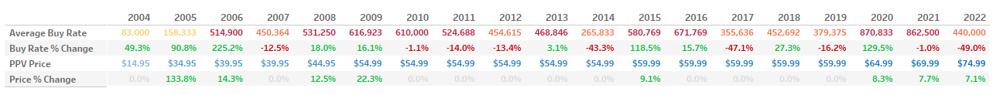
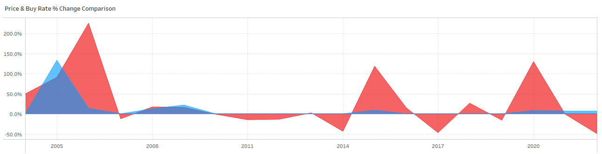

# UFC Pay-Per-View (PPV) Price and Buy Rates Analysis (2004-2022)
## Table of Contents
- [Business Questions](#business-questions)
- [Dashboard Preview](#dashboard-preview)
- [Summary of Insights](#summary-of-insights)
- [Limitations](#limitations)
- [Recommendations](#recommendations)

## Business Questions  
- What effect have the increases in PPV prices over the years had on buy rates?
- Which years had the largest changes in average buy rate numbers and what contributing factors were there?

## Data Collection
All data was collected through reputable MMA media reporters and websites.

## Dashboard Preview
Table showcasing YOY percent changes in average buy rates and prices

Area graph depicting results

The full interactive Tableau dashboard can be found [here](https://public.tableau.com/app/profile/jed.jovellanos/viz/UFCPPVBuyRatevsPrice2004-2022/Dashboard4)

## Summary of Insights
While some of the years with the largest percent changes in average buy rates did tend to coincide with price increases, not all price increases were met with considerable changes in buy rates.
  
### Positive changes in buy rates and prices
- 2006 - average buy rates increased 225.2% and prices increased 14.3%. The explosion in popularity could be largely attributed to the reality TV show _"The Ultimate Fighter"_, which first aired on Spike TV the previous year, exposing many new viewers to the sport.
- 2015 - average buy rates increased 118.5% and prices increased 9.1%. This year held three cards headlined UFC fan favorite and Women's Bantamweight Champion, Ronda Rousey. Rising superstar, Conor McGregor, also headlined two cards this year, the latter of which (UFC 194) was the second card that year to surpass 1M PPV buys and was the UFC's third highest selling PPV event up to that point. 
- 2020 - average buy rates increased 129.5% and prices increased 8.3%. Another hugely impactful year for the company as the UFC became the first major sporting organization to resume live events in the midst of the COVID-19 pandemic. With no competition, viewership soared, seemingly unaffected by the price bump likely due to the lack of other live entertainment options.

### Negative changes in buy rates with positive changes in prices
- 2022 - average buy rates decreased 49.0% (the largest negative percentage change throughout the analysis period) and prices went up 7.1% (reaching the highest price throughout the entire analysis period). It is important to note that correlation does not equal causation and the substantial dip in average buy rates cannot be blamed entirely on price inflation. Perhaps it is the wave of hype from 2020 finally dying down, or maybe the rise in online piracy and streaming websites has enabled more people to get around the high paywall. More investigation would need to be done first in order to reach a more solid conclusion (see [Recommendations](#recommendations)).

### Changes in buy rates with no change in prices
- Average buy rate increased 49.3% in 2004. No clear explanation as to why.
- Average buy rate dropped 12.5% in 2007, possibly in response to the popularity surge from 2006 dying down.
- Average buy rate dropped 14.0% and 13.4% in 2011 and 2012, respectively. No clear explanation as to why.
- Average buy rate dropped 43.4% and 47.1% in 2014 and 2017, respectively. No clear explanation as to why.

### Price increases with minimal buy rate impact
- 2008 - Prices increased 12.5% and buy rates increased 18.0%
- 2009 - Prices increased 22.3% and buy rates increased 16.1%. Interesting to note how the price changed more but seemed to have even less of an impact than the previous year.
- 2021 - Prices increased 7.7% and buy rates decreased 1.0%
  
For a majority of the analysis period, customer demand appears to react more to factors such as fighter popularity or audience growth rather than PPV prices.
 
## Limitations
- PPV buy numbers are not entirely reflective of audience demand as certain fighters may be largely popular and bring in more viewers from regions where UFC events are broadcasted on television for free or at lower prices (various European and Russian countries). After the UFC's deal with ESPN in 2018, PPV events could only be purchased through the ESPN+ subscription service and numbers from after this period come only from domestic purchases and international numbers are not included.
- The data gathered is not comprehensive due to the company not having disclosed PPV numbers for thirty-two events throughout the analysis period with over half of these missing numbers coming from events between 2020 and 2022 (filtering out the undisclosed events during the calculations ensures comparative consistency between years)

## Recommendations
- Investigate if the data from 2022 indicates an approaching price threshold
- Collaborate with the media and marketing teams to see if social media trends during this period indicate similar results 

