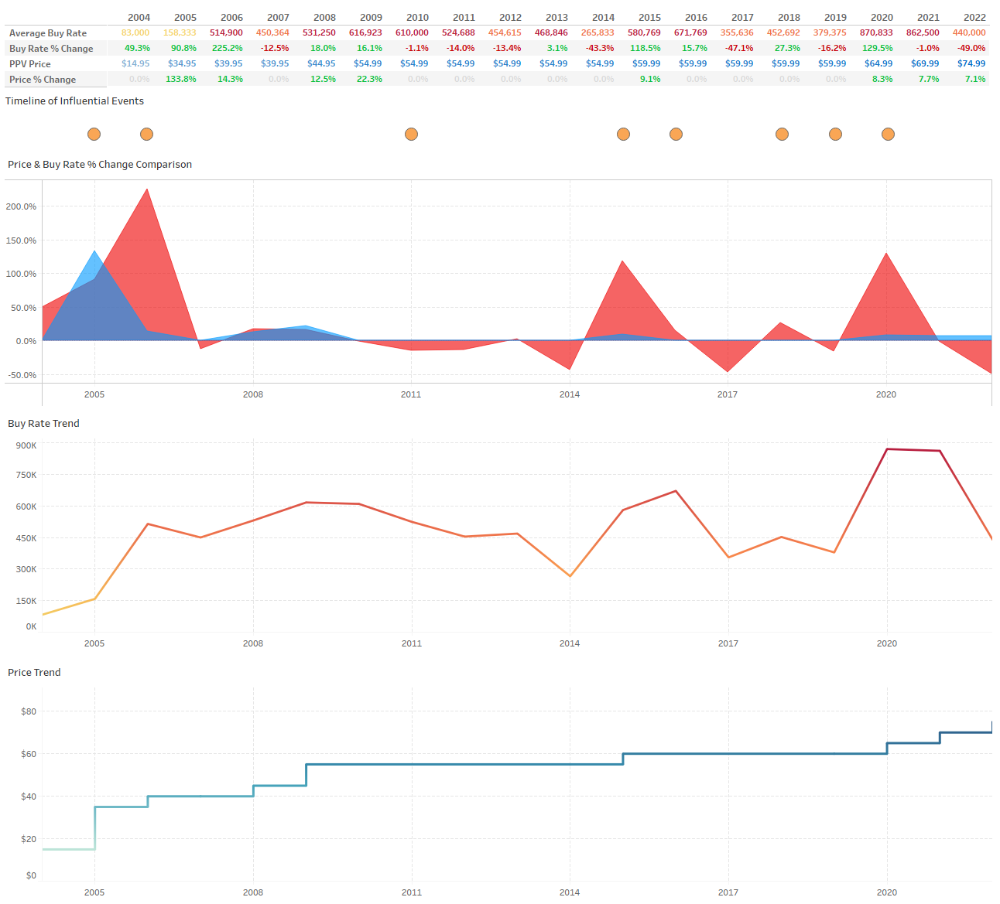

# UFC-PPV-Analysis

<h1>UFC PPV Price and Buy Rates Analysis (2004-2022)</h1>
Exploratory analysis project that compares UFC PPV prices to average buy rates between the years 2004 and 2022. Interactive Tableau dashboard can be found <a  href="https://public.tableau.com/app/profile/jed.jovellanos/viz/UFCPPVBuyRatevsPrice2004-2022/Dashboard4" target="_blank">here</a>.

<h2>Summary of Insights</h2>
<ul>For a majority of the analysis period, customer demand appears to react more to factors other than PPV prices (fighter popularity, audience growth, etc) as highlighted in the Timeline of Influential Events on the <a href="https://public.tableau.com/app/profile/jed.jovellanos/viz/UFCPPVBuyRatevsPrice2004-2022/Dashboard4" target="_blank">dashboard</a>. </ul>
<ul>One exception can be seen between 2021 and 2022 as average buy rates exhibited the largest percent change drop (-49.0%) while prices increased to $74.99 (7.1%)</ul>
<!--
<h3>Milestone years</h3>
<ul><strong>2006:</strong> The previously struggling promotion gained many new eyes after its reality TV show, "The Ultimate Fighter", debuted on Spike TV the year prior. The increase in attention resulted in a 225.2% increase in buy rates from the previous year, the largest percent change of the entire analysis period.</ul>
<ul><strong>2015:</strong> UFC fan favorites: Ronda Rousey and Conor McGregor headlined five events this year, all of which brought in a combined 4.6M PPV buys resulting in a 118.5% increase from 2014's average.</ul>
<ul><strong>2020:</strong> The UFC gains a huge surge in viewership due to the lack of competition as they become the first sporting organization to resume live events during the COVID-19 Pandemic resulting in a 129.5% increase in average buy rates. </ul>
-->
<h3>Limitations</h3>
<ul>PPV buy numbers are not entirely reflective of audience demand as certain fighters may be largely popular and bring in more viewers from regions where UFC events are broadcasted on television for free. </ul>
<ul>The data gathered is not comprehensive due to the company not having disclosed PPV numbers for thirty-two events throughout the analysis period with over half of these missing numbers coming from events between 2020 and 2022.</ul>

<h2>Recommendations</h2>
<ul>Investigate if the data from 2022 indicates an approaching price threshold</ul>
<ul>Collaborate with the media and marketing team to see if social media trends during this period indicate similar results</ul>

